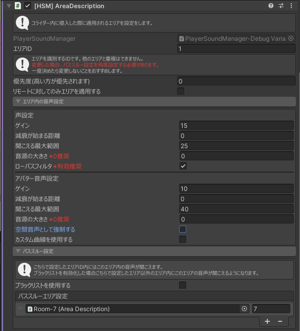

---
id: AreaDescription
sidebar_position: 2
---

import AreaDescription from './_partials/areaDescription.mdx'

# AreaDescription

場所 : `Hanataba/SoundManager/[HSM] AreaDescription`

コライダーによって音声の切り替わるエリアを定義できます。

:::warning[注意]
コライダーコンポーネントが同じオブジェクト内にない場合動作しません。
:::

:::info
コライダーは `Is Trigger` のチェックをつける必要があります。
:::

<AreaDescription/>