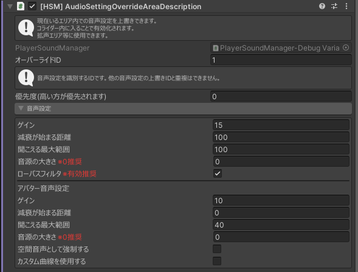

---
id: AudioSettingOverrideAreaDescription
sidebar_position: 4
---

import AudioSettingOverrideAreaDescription from './_partials/audioSettingOverrideAreaDescription.mdx'

# AudioSettingOverrideAreaDescription

場所 : `Hanataba/SoundManager/[HSM] AudioSettingOverrideAreaDescription`

コライダーによって音声設定を上書きできるエリアを定義できます。

防音室にはしないが、音声の設定を変えたい際に使用できます。

> 例 : 拡声エリア等

:::warning[注意]
コライダーコンポーネントが同じオブジェクト内にない場合動作しません。
:::

:::info
コライダーは `Is Trigger` のチェックをつける必要があります。
:::

<AudioSettingOverrideAreaDescription/>