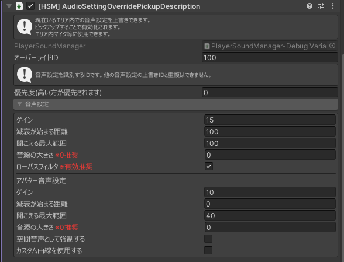

---
sidebar_position: 5
---
# AudioSettingOverridePickupDescription

import AudioSettingOverrideAreaDescription from './_partials/audioSettingOverrideAreaDescription.mdx'

場所 : `Hanataba/SoundManager/[HSM] AudioSettingOverridePickupDescription`

オブジェクトを持つことによって音声設定を上書きできるエリアを定義できます。

防音室にはしないが、音声の設定を変えたい際に使用できます。

現在いるエリア内に聞こえるマイク等に使用できます。

:::warning[注意]
`VRC Pickup` が同じオブジェクト内にない場合動作しません。
:::

<AudioSettingOverrideAreaDescription/>