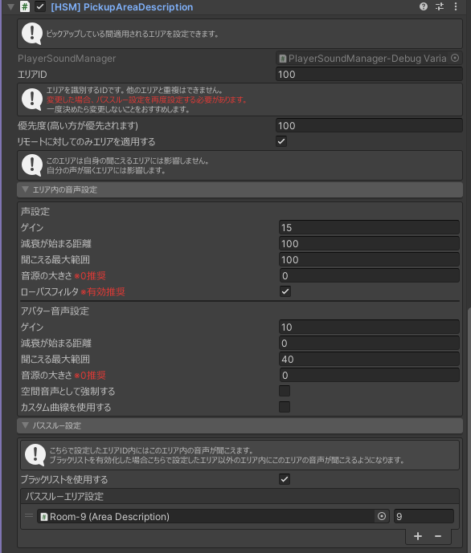

---
sidebar_position: 3
---

import AreaDescription from './_partials/areaDescription.mdx'

# PickupAreaDescription

場所 : `Hanataba/SoundManager/[HSM] PickupAreaDescription`

オブジェクトを持つによって音声の切り替わるエリアを定義できます。
マイク等に使用できます。

:::warning[注意]
`VRC Pickup` が同じオブジェクト内にない場合動作しません。
:::

<AreaDescription/>