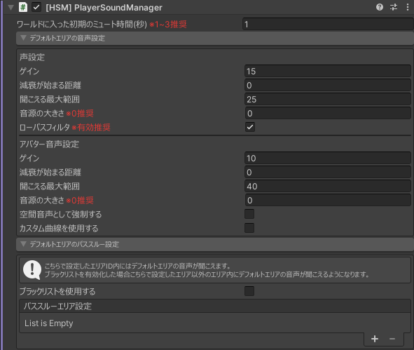

---
sidebar_position: 1
---
import VoiceSettingParameter from './_partials/voiceSettingParameter.mdx'
import AvatarAudioSettingParameter from './_partials/voiceSettingParameter.mdx'

# PlayerSoundManager

場所 : `Hanataba/SoundManager/[HSM] PlayerSoundManager`

音声を制御するメインコンポーネントです。
また、通常エリアの音声設定も指定できます。

:::danger[注意]
ワールド内に複数配置すると正常に動作しません。
必ず必要1つ配置してください。
:::

:::warning[注意]
動作させるためには専用の子オブジェクトが必要です。

プレハブを使用するか、自動生成ボタンを押し、必要なオブジェクトを生成してください。

プレハブは `Assets/Hanataba/Udon/HanatabaSoundManager/Prefab/PlayerSoundManager.prefab` にあります。
:::
---
## パラメータ説明
#### ワールドに入った初期のミュート時間(秒)
ワールドにJoinした際に初期設定されるミュート時間です。

1 ~ 3 程度で設定することをおすすめします。

:::warning[注意]
0秒に設定すると、同期の関係で、入った瞬間に防音室の音声が聞こえる可能性があります。
:::
### デフォルトエリアの音声設定 - 声設定
エリア内に入ってない通常エリア内での声の音声設定を指定できます。

<VoiceSettingParameter/>

### デフォルトエリアの音声設定 - アバター音声設定
エリア内に入ってない通常エリア内でのアバター内に組み込まれているオーディオソースの音声設定を指定できます

<AvatarAudioSettingParameter/>

### デフォルトエリアのパススルー設定
ここに指定したエリア内に、デフォルトエリアの音声が聞こえるようになります。

#### ブラックリストを使用する
有効化するとパススルー設定がブラックリストになります。

すべてのエリアに対しデフォルトエリアの音声が聞こえるようになり、指定したエリア内のみ聞こえなくなります。

- デフォルト : オフ

#### パススルーエリア設定
デフォルトエリア内の音声が聞こえるエリアを指定できます。